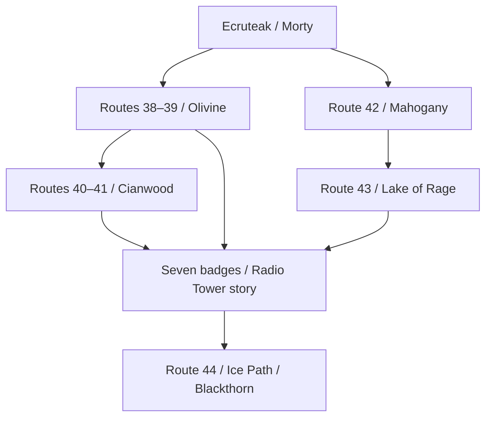

# Tails of the Trio: progression and map identity reference

Source snapshot: `724570bfcb4268d48837a76d8f751d77ca4e8318`, branch `feat/riko-bijuu-mega-forms`.
Reviewed October 7, 2026 Pacific / October 8 UTC. Source tracing, not an emulator walkthrough.
Read alongside [the item/species guide](trio_modding_reference.md). [Reviewed map inventory](trio_progression_maps.json) contains 61 map headers, connections, warp indices, story coordinate triggers, and identified custom pet objects.

## Agent instructions: read this before placing early-game content

The game starts in **New Bark Town, Johto**, in the player's upstairs bedroom at (4,4).
The first outdoor route is **Route 29**. **Routes 30 and 31 precede Violet City, the first gym town.**
Route 120 is not the starting route. An inherited Emerald trainer ID or map filename does not establish where a player encounters an event.

For every proposed story edit, report:
1. Player-facing location and progression milestone.
2. Actual map ID and source directory.
3. Object or coordinate trigger and script label.
4. Relevant flag/variable prerequisites.
5. Trainer/item/species constants called by that script.
6. Whether .pory is the authoring source and .inc is generated.

Use existing save-state milestones for dialogue progression. Route numbers, map-array order, and trainer-name suffixes are not chronology.

## 1. Why the repository is confusing

This is an expanded **Johto adventure built on Emerald's GBA engine**. Its README describes a Johto-focused expansion. The source retains Emerald maps, older Kanto maps, reused scripts, test areas, and custom additions.

| Kind of name | What it means | What it does not prove |
|---|---|---|
| NewBarkTown / MAP_NEW_BARK_TOWN | Current map directory and ID | All scripts using old professor identifiers were renamed |
| MAPSEC_NEW_BARK_TOWN | Region/name label | Every map using this section is the normal town |
| LAYOUT_NEW_BARK_TOWN | Tile layout reference | Player starts here rather than in an interior |
| TRAINER_BRENDAN_ROUTE_103_* | A trainer record's inherited identifier | That it is the opening rival |
| MAP_MAUVILLE_CITY_GAME_CORNER | Reused interior map | The player traveled to Hoenn |
| WorldHub / WorldHub2 | Maps with New Bark region label | The normal opening story proceeds through them |
| Route120 | Emerald map with Fortree/Route121 connections | It participates in Johto's opening |

Concrete evidence:
- src/new_game.c explicitly sets saved map group/number to MAP_NEW_BARK_TOWN_PLAYERS_HOUSE_2F, warpId none, coordinates and live position (4,4).
- NewBarkTown connects west to Route29 and east to Route27. East is a later branch, not the opening objective.
- Route120's reviewed header connects to Fortree City and Route121. It is listed in gMapGroup_Emerald1, not the New Bark opening chain.
- The map-group file also has metadata such as rom_shared_script_maps. Do not interpret every top-level array as a separate geographical group.
- The docs generator excludes Emerald groups and numerous legacy Kanto names from player-facing trainer docs. Those exclusions are editorial filters, not a proof that every excluded map can never be reached.
- GoldenrodCity actually warps into MAP_MAUVILLE_CITY_GAME_CORNER. This is an example of an old Emerald name reused by an active Johto destination.

## 2. Opening progression: exact source-backed sequence

| Step | Player experience | Actual source location | Important event/state |
|---:|---|---|---|
| 1 | Start upstairs at home | NewBarkTown_PlayersHouse_2F | src/new_game.c sets spawn (4,4); clock setup may run if RTC initialization did not complete it |
| 2 | Go downstairs and outside | NewBarkTown_PlayersHouse_1F → NewBarkTown | 2F warp 0 → 1F warp 1; 1F exterior warp → town warp 1 |
| 3 | Visit Elm and choose a starter | NewBarkTown_Lab | Starter flow sets VAR_RIVAL_STATE=2 and sends player toward Mr. Pokémon |
| 4 | Opening friendly rival battle | NewBarkTown | RivalBattle activates at VAR_RIVAL_STATE=2; uses TRAINER_RIVALGOLD1 or TRAINER_RIVALCRYSTAL1 |
| 5 | Travel west | Route29 | Connects New Bark ↔ Cherrygrove |
| 6 | Visit Cherrygrove | CherrygroveCity | Route29 to the east; Route30 to the north |
| 7 | Head north, visit Mr. Pokémon | Route30 → Route30_MrPokemonsHouse | Mystery Egg/Pokédex event updates lab and Cherrygrove states |
| 8 | Elm calls; return to New Bark | Route30 → Cherrygrove → Route29 → NewBarkTown_Lab | Route30 call changes VAR_CHERRYGROVE_CITY_STATE from 2 to 3; lab handles theft report |
| 9 | Start the main adventure and receive Balls | NewBarkTown_Lab | Sets FLAG_ADVENTURE_STARTED; aide grants 10 Poké Balls and FLAG_RECEIVED_FIRST_BALLS |
| 10 | Retrace north, then turn west | Route29 → Cherrygrove → Route30 → Route31 | Route31 connects north from Route30 and west to Violet |
| 11 | Optional Bijuu chase/capture | Route31 | Before first gym; requires first-Balls flag and at least one ITEM_POKE_BALL |
| 12 | First gym town | VioletCity | Gym, Sprout Tower, and egg-related progression; Falkner grants badge 1 |

Current custom content:
- New save starts with level-5 Riko, Penny/Fidough, and Riko Spirit, then adds the chosen starter.
- The opening Gold/Crystal trainer records each contain three level-5 Fidoughs.
- Route30 holds the Wand/Brush pickup at (28,32).
- Route31's Bijuu object starts at (28,12), uses LOCALID_ROUTE31_BIJUU and FLAG_CAUGHT_BIJUU. Two interactions chase it to (32,12), then (36,12); the next starts a level-8 wild battle. Only catching it sets the caught flag.
- Bijuu's current check specifically tests an ordinary Poké Ball, not any capture-ball type.
- A fresh-save inventory change and an event pickup are separate acquisition paths.

There is also a Silver/theft return-story thread. Do not conflate it with the opening friendly Gold/Crystal battle. This reference confirms the opening battle's exact trainer IDs; inspect Cherrygrove's return-story script before editing a different rival encounter.

Current source discrepancy: NewBarkTown/scripts.pory and scripts.inc disagree on rival text. Update .pory and regenerate rather than relying on the current .inc alone.

## 3. Main Johto progression through the first League

This is a story-placement reference. Connections can offer shortcuts or side branches, and collision/HM gates require gameplay verification.

| Milestone | Main geographical corridor | Gym/event anchor | Recorded trainer levels |
|---|---|---|---|
| Opening / before badge 1 | New Bark → Route29 → Cherrygrove → Route30 → Route31 → Violet | Elm, Mr. Pokémon, Bijuu, Sprout Tower, Falkner | Opening rival 5; Falkner 11–12 |
| Badge 1 → badge 2 | Violet → Route32 → Route33 → Azalea; Union Cave links Routes32/33 | Slowpoke Well/Azalea story, Bugsy | Bugsy 19–20 |
| Badge 2 → badge 3 | Azalea → Ilex Forest → Route34 → Goldenrod | Forest passage and Whitney | Whitney 25–27 |
| Badge 3 → badge 4 | Goldenrod → Route35 / National Park → Route36 → Route37 → Ecruteak | Squirtbottle/Sudowoodo; Ecruteak/Burned Tower story; Morty | Morty 33–34 |
| Midgame western branch | Ecruteak → Route38 → Route39 → Olivine → Route40 → Route41 → Cianwood | Lighthouse/medicine arc; Jasmine and Chuck | Teams vary with other midgame gyms |
| Midgame eastern branch | Ecruteak → Route42 → Mahogany → Route43 → Lake of Rage | Lake/Rocket hideout arc; Pryce | Teams vary with other midgame gyms |
| Seven-badge story | Return to Goldenrod Radio Tower / Underground | Rocket story before late eastern corridor | Inspect active Rocket state and entrance script |
| Badge 8 | Mahogany → Route44 → Ice Path → Blackthorn | Clair, then Dragon's Den badge sequence | Clair 57–58 |
| Pre-League legendary story | Return to Elm → Ecruteak Theater → Whirl Islands or Tin Tower | FLAG_LEGENDARY_STORY_CAP | Mandatory gate in ReceptionGate |
| First League | New Bark east → Route27 → Route26 → Route26North → ReceptionGate → Victory Road → Route28 League entrance | Eight-badge/story gate; Elite Four and Champion | Reviewed first teams approximately 67–71 |

Level ranges are taken from current trainers.party records, not guarantees of effective battle level. Options/scaling and selected variant records can change actual behavior.

### Do not force a rigid 5 → 6 → 7 sequence

The badge identities are fixed, but the three midgame gym scripts branch based on which others are beaten:
- Chuck: badge 5.
- Jasmine: badge 6.
- Pryce: badge 7.

Their _1 teams are around levels 41–42; _1_2 teams 44–45; _1_3 teams 47–48. The scripts select variants using the other gyms' defeated flags.

A dialogue line such as “You already beat Jasmine” must test Jasmine's flag. It should not assume that reaching Mahogany implies beating both western gyms. The same applies to a legendary-trio story that grows more confident with the player's reputation.

### Actual progression gates checked in source

| Gate | Source requirement |
|---|---|
| Leaving Violet south through the checked Route32 trigger | FLAG_HIDE_SPROUT_TOWER_SILVER, FLAG_DEFEATED_VIOLET_GYM, and FLAG_RECEIVED_TOGEPI_EGG must be set |
| Getting Squirtbottle in Goldenrod Flower Shop | FLAG_BADGE03_GET |
| Sudowoodo corridor | Route36 checks Squirtbottle and clears the blocker through its event; reaching a connection alone does not remove the tree |
| Radio Tower call | Mahoganytown script checks VAR_NUM_BADGES ≥ 7 before its call setup |
| Receiving badge 8 | Dragon's Den Shrine script sets FLAG_BADGE08_GET and FLAG_DEFEATED_BLACKTHORN_GYM; winning Clair alone sets a challenge state |
| ReceptionGate trigger | FLAG_BADGE08_GET and FLAG_LEGENDARY_STORY_CAP |
| Pre-League directions | Gate chooses Elm, Kimono Girls, Whirl Islands, or Tin Tower guidance from lab/theater state and VAR_LUGIA_OR_HOOH |

A persistent flag's name can be inherited or counterintuitive. For example, FLAG_HIDE_SPROUT_TOWER_SILVER is used as a completion prerequisite; it does not mean the player must interact with a currently visible Silver there.

## 4. Combined/reused maps and nonstandard links

| Player-facing area | Actual identity / connection | Editing implication |
|---|---|---|
| New Bark upstairs | NewBarkTown_PlayersHouse_2F | New-game spawn is an interior, not Route120 or InsideOfTruck |
| New Bark experimental branch | Town warps to WorldHub and TinTowerRoofDay | Source-defined branches exist; do not treat them as normal main-story progression |
| WorldHub / WorldHub2 | Both display under New Bark region; hub contains reused leader/event objects | Same region label is not the same story map |
| Cherrygrove / Route32 | Direct west/east map connection exists | Likely water/geography branch; not proof of early walkable bypass |
| Route32 / Route33 | Direct connection plus Union Cave warps | Cave is present, but map adjacency alone cannot establish that traversing it is mandatory |
| Violet / Route36 | Direct west connection | Sudowoodo/story gates matter more than simple adjacency |
| Goldenrod Game Corner | MAP_MAUVILLE_CITY_GAME_CORNER | An Emerald-named interior can be active in Johto |
| FoggyShore | Region section Route34 | Internal southern Route34 connector |
| FoggyShore2 | Region section named South Shore | Separate expanded area despite similar internal filename |
| Route26North | Shares Route26 region section | Second map segment of displayed Route26 |
| First League foyer | IndigoPlateau_PokemonCenter, reached from Route28 | Use this actual entrance, not the excluded older outdoor IndigoPlateau map |
| VictoryRoadKanto_B2F/B1F/1F | Connected between ReceptionGate and Route28 | Active Johto League approach can have Kanto in its internal name |
| Route120 | Fortree/Route121 connections, Emerald group | No evidence it is part of the opening progression |

The previous history mentioned bedroom stairs diverting to the Spirit cave. At this snapshot the primary upstairs stair warp leads to the normal 1F house; do not carry that old routing assumption into new edits.

### League map topology

ReceptionGate warps to VictoryRoadKanto_B2F.
That map warps to B1F, which links to 1F, which exits to Route28.
Route28 has a warp directly into IndigoPlateau_PokemonCenter.
The foyer leads to Will → Koga → Bruno → Karen.
Karen's next warp is MAP_DYNAMIC: her script chooses the first Champion room or the title-defense room according to FLAG_IS_CHAMPION.

This is why “Indigo Plateau” or “Victory Road” searched by filename alone can land on the wrong version.

## 5. Compact branching map

This diagram shows the major midgame branch, not all walkable tiles or optional areas.

The arrows into the seven-badge milestone express story milestones, not a direct warp. The western/eastern branches can be visited in varying order.

## 6. Postgame and expansion boundaries

Do not import the standard SoulSilver Kanto walkthrough as this hack's verified postgame.

The current ElmPostgameHint source:
- Sets FLAG_POSTGAME_FEATURES.
- Points to the Battle Tower near Route40/Olivine.
- Points to the rival at Mt. Silver.
- Sets FLAG_HIDE_MTSILVER_GUARD and FLAG_ALLOW_SOUTH_JOHTO_PASS.
- Sets lab and New Bark state to 11.

The map graph also exposes custom expansion branches, including:
- Route39 → Route49.
- Lake of Rage → Route50.
- Route45 → KitakamiBorder.
- Route34 → FoggyShore → South Shore → southern maps.
- Route37 → BattleFactoryGrounds.
- Olivine → GoldenrodShore.

These are source-defined connections. Exact entry requirements, availability, and ordering were not fully traced in this pass. The README says the Factory is available after gym 3; confirm the current entrance script before adding an event there.

Legacy Kanto and Emerald assets remain in the repository. No complete Kanto campaign or Hoenn progression is established by their existence. Check actual warps, script warps, and story flags before planning content in them.

## 7. How to place a growing pet story safely

Use phases that are stable across branch choices:

| Phase | Good locations for trio dialogue | State to inspect |
|---|---|---|
| Rumors before first gym | New Bark, Cherrygrove, Routes29–31, Violet | Adventure start; received Balls; caught Bijuu |
| First recognition | Azalea / Goldenrod | First two or three gym milestones |
| Trio is becoming famous | Ecruteak and midgame western/eastern towns | Morty flag; defeated Chuck/Jasmine/Pryce flags independently |
| Leaders take the trio seriously | Rocket story / Blackthorn | Number of badges, Rocket progress, Clair/Den state |
| Legendary confrontation | Elm, Theater, Whirl Islands/Tin Tower | Legendary story variables and completion cap |
| Champion-level reputation | League/postgame NPCs | FLAG_IS_CHAMPION and FLAG_POSTGAME_FEATURES |

This is suggested narrative design, not implemented dialogue. Presence of the custom pets should be checked separately if a line claims the player currently has all three. The current test party includes Spirit in place of Bijuu until the Route31 capture.

For a requested “early item,” identify the intended phase first:
- Immediate testing: src/new_game.c after ClearBag.
- First village journey: New Bark / Route29 / Cherrygrove.
- Before first gym: Route30 or Route31.
- After badge 1: an actual Route32 event gated by Violet progression.
- Midgame shop: verify its active shop stock path, not just its town name.

## 8. Quick lookup for common editing requests

| Request | First source to inspect |
|---|---|
| Starting party or Bag | src/new_game.c |
| Starting map | src/new_game.c, then NewBarkTown_PlayersHouse_2F/map.json |
| Mom/home dialogue | NewBarkTown_PlayersHouse_1F/scripts.inc |
| Elm/lab dialogue | NewBarkTown_Lab/scripts.pory |
| Opening Gold/Crystal battle | NewBarkTown/scripts.pory → TRAINER_RIVALGOLD1 / TRAINER_RIVALCRYSTAL1 |
| Mr. Pokémon | Route30_MrPokemonsHouse/scripts.inc |
| Wand/Brush pickup | Route30/map.json and scripts.inc |
| Bijuu acquisition | Route31/map.json and scripts.inc |
| First gym | VioletCity_Gym/scripts.pory |
| Route32 blocker | Route32/scripts.inc |
| Badge 3 / Squirtbottle | GoldenrodCity_Gym and GoldenrodCity_FlowerShop .pory |
| Midgame gym progression | CianwoodGym/scripts.inc; OlivineCity_Gym and MahoganyTown_Gym .pory |
| Badge 8 award | DragonsDen_Shrine/scripts.inc |
| League access | ReceptionGate/scripts.inc |
| Postgame handoff | NewBarkTown_Lab/scripts.pory, ElmPostgameHint |

## 9. Verification limits and evidence

Reviewed: spawn code, early story scripts, 61 map headers, eight Johto gym battle paths, midgame team variants, Route32/Sudowoodo gates, Dragon's Den badge award, League gate/warps, and Elm's postgame handoff.
Not performed: an emulator playthrough, tile collision review, every custom side-area unlock, or every rival encounter.

The accompanying JSON is a partial inventory of the maps reviewed here, not a full reachability solver. MAP_DYNAMIC needs script resolution; connection direction and offset do not establish story order; object/coordinate triggers can block a theoretically connected route.

Pinned source links:
- [src/new_game.c](https://github.com/badabingbadaboom850/modding-sandbox/blob/724570bfcb4268d48837a76d8f751d77ca4e8318/src/new_game.c)
- [data/maps/NewBarkTown/map.json](https://github.com/badabingbadaboom850/modding-sandbox/blob/724570bfcb4268d48837a76d8f751d77ca4e8318/data/maps/NewBarkTown/map.json)
- [data/maps/NewBarkTown_PlayersHouse_2F/map.json](https://github.com/badabingbadaboom850/modding-sandbox/blob/724570bfcb4268d48837a76d8f751d77ca4e8318/data/maps/NewBarkTown_PlayersHouse_2F/map.json)
- [data/maps/NewBarkTown_Lab/scripts.pory](https://github.com/badabingbadaboom850/modding-sandbox/blob/724570bfcb4268d48837a76d8f751d77ca4e8318/data/maps/NewBarkTown_Lab/scripts.pory)
- [data/maps/NewBarkTown/scripts.pory](https://github.com/badabingbadaboom850/modding-sandbox/blob/724570bfcb4268d48837a76d8f751d77ca4e8318/data/maps/NewBarkTown/scripts.pory)
- [data/maps/Route29/map.json](https://github.com/badabingbadaboom850/modding-sandbox/blob/724570bfcb4268d48837a76d8f751d77ca4e8318/data/maps/Route29/map.json)
- [data/maps/CherrygroveCity/map.json](https://github.com/badabingbadaboom850/modding-sandbox/blob/724570bfcb4268d48837a76d8f751d77ca4e8318/data/maps/CherrygroveCity/map.json)
- [data/maps/Route30/map.json](https://github.com/badabingbadaboom850/modding-sandbox/blob/724570bfcb4268d48837a76d8f751d77ca4e8318/data/maps/Route30/map.json)
- [data/maps/Route30_MrPokemonsHouse/scripts.inc](https://github.com/badabingbadaboom850/modding-sandbox/blob/724570bfcb4268d48837a76d8f751d77ca4e8318/data/maps/Route30_MrPokemonsHouse/scripts.inc)
- [data/maps/Route31/map.json](https://github.com/badabingbadaboom850/modding-sandbox/blob/724570bfcb4268d48837a76d8f751d77ca4e8318/data/maps/Route31/map.json)
- [data/maps/Route31/scripts.inc](https://github.com/badabingbadaboom850/modding-sandbox/blob/724570bfcb4268d48837a76d8f751d77ca4e8318/data/maps/Route31/scripts.inc)
- [data/maps/VioletCity/map.json](https://github.com/badabingbadaboom850/modding-sandbox/blob/724570bfcb4268d48837a76d8f751d77ca4e8318/data/maps/VioletCity/map.json)
- [data/maps/Route32/scripts.inc](https://github.com/badabingbadaboom850/modding-sandbox/blob/724570bfcb4268d48837a76d8f751d77ca4e8318/data/maps/Route32/scripts.inc)
- [data/maps/Route36/scripts.pory](https://github.com/badabingbadaboom850/modding-sandbox/blob/724570bfcb4268d48837a76d8f751d77ca4e8318/data/maps/Route36/scripts.pory)
- [data/maps/GoldenrodCity_FlowerShop/scripts.pory](https://github.com/badabingbadaboom850/modding-sandbox/blob/724570bfcb4268d48837a76d8f751d77ca4e8318/data/maps/GoldenrodCity_FlowerShop/scripts.pory)
- [data/maps/CianwoodGym/scripts.inc](https://github.com/badabingbadaboom850/modding-sandbox/blob/724570bfcb4268d48837a76d8f751d77ca4e8318/data/maps/CianwoodGym/scripts.inc)
- [data/maps/OlivineCity_Gym/scripts.pory](https://github.com/badabingbadaboom850/modding-sandbox/blob/724570bfcb4268d48837a76d8f751d77ca4e8318/data/maps/OlivineCity_Gym/scripts.pory)
- [data/maps/MahoganyTown_Gym/scripts.pory](https://github.com/badabingbadaboom850/modding-sandbox/blob/724570bfcb4268d48837a76d8f751d77ca4e8318/data/maps/MahoganyTown_Gym/scripts.pory)
- [data/maps/Mahoganytown/scripts.inc](https://github.com/badabingbadaboom850/modding-sandbox/blob/724570bfcb4268d48837a76d8f751d77ca4e8318/data/maps/Mahoganytown/scripts.inc)
- [data/maps/DragonsDen_Shrine/scripts.inc](https://github.com/badabingbadaboom850/modding-sandbox/blob/724570bfcb4268d48837a76d8f751d77ca4e8318/data/maps/DragonsDen_Shrine/scripts.inc)
- [data/maps/ReceptionGate/scripts.inc](https://github.com/badabingbadaboom850/modding-sandbox/blob/724570bfcb4268d48837a76d8f751d77ca4e8318/data/maps/ReceptionGate/scripts.inc)
- [data/maps/IndigoPlateau_PokemonCenter/map.json](https://github.com/badabingbadaboom850/modding-sandbox/blob/724570bfcb4268d48837a76d8f751d77ca4e8318/data/maps/IndigoPlateau_PokemonCenter/map.json)
- [data/maps/PokemonLeague_KarensRoom/scripts.inc](https://github.com/badabingbadaboom850/modding-sandbox/blob/724570bfcb4268d48837a76d8f751d77ca4e8318/data/maps/PokemonLeague_KarensRoom/scripts.inc)
- [data/maps/Route120/map.json](https://github.com/badabingbadaboom850/modding-sandbox/blob/724570bfcb4268d48837a76d8f751d77ca4e8318/data/maps/Route120/map.json)
- [data/maps/map_groups.json](https://github.com/badabingbadaboom850/modding-sandbox/blob/724570bfcb4268d48837a76d8f751d77ca4e8318/data/maps/map_groups.json)
- [tools/soulgold_docs/map_names.py](https://github.com/badabingbadaboom850/modding-sandbox/blob/724570bfcb4268d48837a76d8f751d77ca4e8318/tools/soulgold_docs/map_names.py)
- [tools/soulgold_docs/constants.py](https://github.com/badabingbadaboom850/modding-sandbox/blob/724570bfcb4268d48837a76d8f751d77ca4e8318/tools/soulgold_docs/constants.py)
- [src/data/trainers.party](https://github.com/badabingbadaboom850/modding-sandbox/blob/724570bfcb4268d48837a76d8f751d77ca4e8318/src/data/trainers.party)
